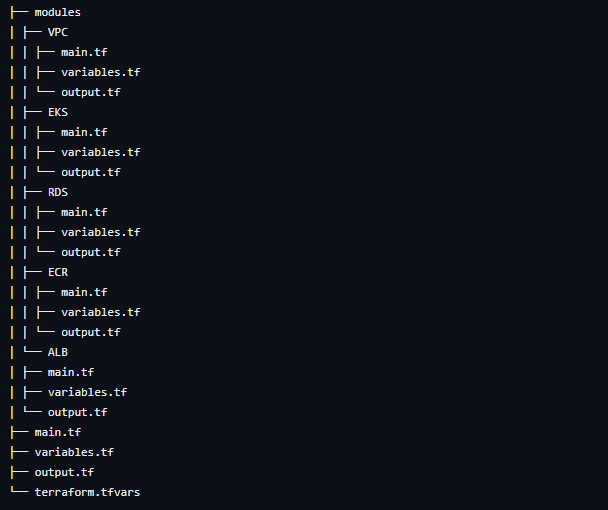

This Terraform project provides infrastructure provisioning using modularized components. It includes modules for VPC, EKS, RDS, ECR, and ALB, each having their respective subfolders containing the main configuration files, variables, and outputs.

## Project Structure

The project structure is organized as follows:




The `modules` directory contains subfolders for each module. Each module has its `main.tf`, `variables.tf`, and `output.tf` files, which define the module's configuration, input variables, and output values, respectively.

The root directory contains the following files:

- `main.tf`: The main configuration file that declares all the modules used in the project.
- `variables.tf`: The file where you can define and customize variables used across the project.
- `output.tf`: The file specifying the outputs to be displayed after provisioning the infrastructure.
- `terraform.tfvars`: The file where you can set the values for the variables defined in `variables.tf`.

## Usage

To use this Terraform project:
   ```
   terraform init
   terraform plan
   terraform apply
